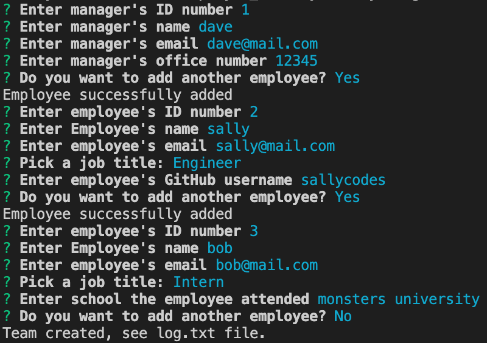

# Employee Summary App

## What is does:
This app allows employers to store employee information for their software development team in a text file.

## How it works:
The user is prompted to answer questions about their employees.  Inputed answers are written to a text file.  Questions vary based on the type of emplyee being stored (options are manager, engineer, and intern).

## Examples:
### Prompts to user

### Text file
